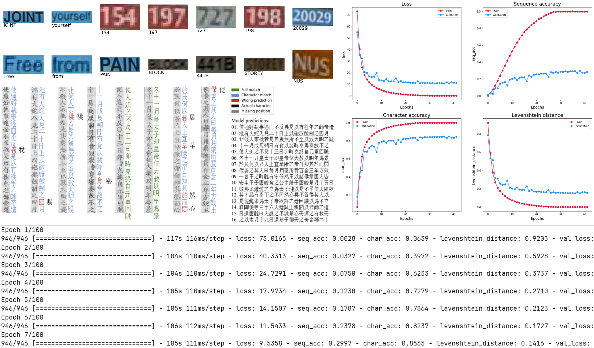

# TFSeqRec: A TF2 Toolkit for Sequence Text Recognition

This package provides a comprehensive set of tools and functionalities to facilitate the model development, training, and evaluation of **Text Recognition**, a sub-task of **Optical Character Recognition** (OCR). 
- This package is particularly designed to handle this **Text Recognition** task at the **Sequence level**, where the input and the output are a sequence of characters or tokens. 
- It is built on top of **TensorFlow 2** with the aim to simplify the process of importing, handling, and visualizing sequence data, as well as providing common loss functions and evaluation metrics often used in the development of **Sequence-level Text Recognition** models.


```bash
pip install tfseqrec
```

# Quick Start



The [demo folder](./demo/) contains 2 Jupyter notebooks that demonstrate how to use this toolkit:

- [demo_nomaocr.ipynb](./demo/demo_nomaocr.ipynb): An end-to-end example of training, evaluating, and inferencing a **CRNN** model for **Sequence-level Text Recognition** on my [NomNaOCR](https://github.com/ds4v/NomNaOCR) dataset.

- [prepare_icdar2015.ipynb](./demo/prepare_icdar2015.ipynb): A step-by-step guide to prepare the [ICDAR 2015](https://rrc.cvc.uab.es/?ch=4&com=tasks) dataset for **Sequence-level Text Recognition** training.

# Key Features and Functionalities

This package is organized into several modules, each of which provides a set of classes/functions to handle a specific aspect of the **Sequence-level Text Recognition** implementation.

**Table of Contents:**
- [I. tfseqrec.loader](#i-tfseqrecloader-):
    - [1️⃣ *class* **`DataImporter`**](#1️⃣-class-dataimporter-dataset_dir-labels_path-min_length4-filter_funcnone-)
    - [2️⃣ *class* **`DataHandler`**](#2️⃣-class-datahandler-dataset-img_size-padding_char-start_char-end_char-)
- [II. tfseqrec.losses](#ii-tfseqreclosses-):
    - [1️⃣ *class* **`CTCLoss`**](#1️⃣-class-ctcloss-namectc_loss-kwargs-)
    - [2️⃣ *class* **`MaskedLoss`**](#2️⃣-class-maskedloss-namemasked_loss-kwargs-)
- [III. tfseqrec.metrics](#iii-tfseqrecmetrics-):
    - [1️⃣ *class* **`SequenceAccuracy`**](#1️⃣-class-sequenceaccuracy-use_ctc_decodefalse-nameseq_acc-kwargs-)
    - [2️⃣ *class* **`CharacterAccuracy`**](#2️⃣-class-characteraccuracy-use_ctc_decodefalse-namechar_acc-kwargs-)
    - [3️⃣ *class* **`LevenshteinDistance`**](#3️⃣-class-levenshteindistance-use_ctc_decodefalse-normalizefalse-namelevenshtein_distance-kwargs-)
- [IV. tfseqrec.visualizer](#iv-tfseqrecvisualizer-):
    - [1️⃣ *class* **`SequenceVisualizer`**](#1️⃣-class-sequencevisualizer-fontsize12-fontpathnone-)
    - [2️⃣ *function* **`plot_training_results`**](#2️⃣-function-plot_training_results-history-save_name-figsize16-14-subplot_size2-2-)
- [V. tfseqrec.utils](#v-tfseqrecutils-):
    - [1️⃣ *function* **`ctc_decode`**](#1️⃣-function-ctc_decode-predictions-max_length---tftensor-)
    - [2️⃣ *function* **`tokens2sparse`**](#2️⃣-function-tokens2sparse-batch_tokens---tfsparsetensor-)
    - [3️⃣ *function* **`sparse2dense`**](#3️⃣-function-sparse2dense-tensor-shape---tftensor-)

## I. tfseqrec.loader [🔝](#key-features-and-functionalities)

### 1️⃣ *class* **`DataImporter`** (*dataset_dir, labels_path, min_length=4, filter_func=None*) [🔝](#key-features-and-functionalities):

> A class for importing, filtering valuable image, and text data for **Sequence-level Text Recognition** models.

- `dataset_dir` (*str*): The directory path where the dataset is located. This is to construct full paths to images defined in the file in `labels_path`.
- `labels_path` (*str*): The path to the file containing the labels for the dataset. This file should contain lines in this format: `image_name.jpg,text_label`.
- `min_length` (*int*): The minimum length of a label to be considered valid.
- `filter_func` (*callable*): Additional function to further filter labels. Only labels that pass the filter will be included in the dataset. This will remove corresponding images as well.

***Other Attributes***:
- `img_paths` (*list*): A list of file paths to images in the dataset.
- `labels` (*list*): A list of labels corresponding to these images.
- `vocabs` (*set*): A set of unique characters present in the `labels`.
- `size` (*int*): The number of items in the dataset.

For each line of the file located in the `labels_path`, it extracts the full image path and the associated text/label. If the image file exists, the text length is at least `min_length`, and the text/label passes the `filter_func` (if provided), the full image path and the text will be added to `img_paths` and `labels`, respectively. Finally, the `vocabs` or the frequency of each character in the `labels` will be computed.

👉 **remove_rare_chars** (*threshold=2*) -> [**`DataImporter`**](#1️⃣-class-dataimporter-dataset_dir-labels_path-min_length4-filter_funcnone-) [🔝](#1️⃣-class-dataimporter-dataset_dir-labels_path-min_length4-filter_funcnone-):

> Remove items from `img_paths` and `labels` that contains characters appearing less than a certain `threshold`.

- `threshold` (*int*): The minimum frequency of a character to be considered as not rare. Must be >= 2.

***return***: The updated [**`DataImporter`**](#1️⃣-class-dataimporter-dataset_dir-labels_path-min_length4-filter_funcnone-) object with rare characters removed.

It identifies rare characters and the indices of labels containing them by iterating over the `vocabs` from least to most common. Then, it removes these labels and their corresponding images, recalculates the `vocabs`, and updates the `size`. If there are still rare characters in the `labels`, it recursively calls itself with the same `threshold` until all rare characters are removed.

👉 **__str__**() -> **str** [🔝](#1️⃣-class-dataimporter-dataset_dir-labels_path-min_length4-filter_funcnone-):

```python
f'- Number of images found: {len(img_paths)}\n'
f'- Number of labels found: {len(labels)}\n'
f'- Number of unique characters: {len(vocabs)}\n'
f'- Characters present: {vocabs}'
```
***return***: A string representation of the [**`DataImporter`**](#1️⃣-class-dataimporter-dataset_dir-labels_path-min_length4-filter_funcnone-) object.

This method can be called when the `print()` or the `str()` function is used on a [**`DataImporter`**](#1️⃣-class-dataimporter-dataset_dir-labels_path-min_length4-filter_funcnone-) object.

### 2️⃣ *class* **`DataHandler`** (*dataset, img_size, padding_char, start_char='', end_char=''*) [🔝](#key-features-and-functionalities):

> A class for handling, preprocessing image, and text data for **Sequence-level Text Recognition** models.

- `dataset` (***DataImporter***): The [**`DataImporter`**](#1️⃣-class-dataimporter-dataset_dir-labels_path-min_length4-filter_funcnone-) object containing the dataset.
- `img_size` (*tuple*): The desired size of the input images.
- `padding_char` (*str*): The character used for padding labels.
- `start_char` (*str*): The character used to indicate the start of a label/sentence.
- `end_char` (*str*): The character used to indicate the end of a label/sentence.

***Other Attributes***:
- `img_paths` (*list*): A list of file paths to the images in the dataset.
- `labels` (*list*): A list of labels corresponding to the images.
- `vocabs` (*set*): A set of unique characters present in the labels.
- `size` (*int*): The number of items in the dataset.
- `max_length` (*int*): The maximum length of the labels in the dataset.
- `token_mask` (*dict*): A dictionary mapping characters to their corresponding indices.
- `char2num` ([*tf.keras.layers.StringLookup*](https://www.tensorflow.org/api_docs/python/tf/keras/layers/StringLookup)): TF2 preprocessing layer that maps strings to (possibly encoded) indices/tokens.
- `num2char` ([*tf.keras.layers.StringLookup*](https://www.tensorflow.org/api_docs/python/tf/keras/layers/StringLookup)): The inverse of `char2num` that maps indices/token IDs back to strings.
- `start_token` (*int*): The index from `char2num` corresponding to the `start_char` if it is defined.
- `end_token` (*int*): The index from `char2num` corresponding to the `end_char` if it is defined.

👉 **distortion_free_resize** (*image, align_top=True*) -> **tf.Tensor** [🔝](#2️⃣-class-datahandler-dataset-img_size-padding_char-start_char-end_char-):

> Resize an image while preserving its aspect ratio and applying distortion-free padding. If the resized image doesn't match the targeted `img_size`, the method will *pad* the image with white color to reach that size.

- `image` (*tf.Tensor*): The input image tensor.
- `align_top` (*bool*): Whether to align the image to the top or center it vertically.

***return***: The resized and padded image tensor.

👉 **process_image** (*img_path, img_align_top=True, channels=3*) -> **tf.Tensor** [🔝](#2️⃣-class-datahandler-dataset-img_size-padding_char-start_char-end_char-):

> Preprocess an image by reading it from file, resizing it using the **distortion_free_resize** method, and normalizing its pixel values to the range [0, 1].

- `img_path` (*str*): The path to the image file.
- `img_align_top` (*bool*): Whether to align the image to the top or center it vertically during resizing.
- `channels` (*int*): The number of color channels in the image.

***return***: The preprocessed image tensor.

👉 **process_label** (*label*) -> **tf.Tensor** [🔝](#2️⃣-class-datahandler-dataset-img_size-padding_char-start_char-end_char-):

> Preprocess a label (a sequence of characters) by converting it into a sequence of integer tokens using the `char2num` mapping. It also adds `start_token` and `end_token` if they are available, and pads the sequence with the padding token to match the `max_length`.

- `label` (*str*): The input label.

***return***: The preprocessed label tensor.

👉 **prepare_tf_dataset** (*idxs, batch_size, channels=3, drop_remainder=False, img_align_top=True, use_cache=True*) -> **tf.data.Dataset** [🔝](#2️⃣-class-datahandler-dataset-img_size-padding_char-start_char-end_char-):

> This is an **all-in-one** method that combines all preprocessing steps above to create a ready-to-use TensorFlow dataset for training or evaluation from the `img_paths` and `labels` obtained from the [**`DataImporter`** ](#1️⃣-class-dataimporter-dataset_dir-labels_path-min_length4-filter_funcnone-) object. It applies the `process_image` and `process_label` methods to each image-label pair in parallel using TensorFlow's `AUTOTUNE` setting. The dataset is batched, optionally cached in memory for faster access, and prefetched for performance.

- `idxs` (*np.ndarray*): The indices of the samples to include in the dataset.
- `batch_size` (*int*): The batch size.
- `channels` (*int*): The number of color channels in the images.
- `drop_remainder` (*bool*): Whether to drop the last batch if it has fewer samples than the `batch_size`.
- `img_align_top` (*bool*): Whether to align the images to the top or center them vertically during resizing.
- `use_cache` (*bool*): Whether to cache the dataset in memory for faster training. If **True**, everything before is saved in the memory. It gives a significant boost in speed but only if you can get your hands on a larger RAM.

***return***: The prepared [TensorFlow dataset](https://www.tensorflow.org/api_docs/python/tf/data/Dataset).

👉 **tokens2texts** (*batch_tokens, use_ctc_decode=False*) -> **List[str]** [🔝](#2️⃣-class-datahandler-dataset-img_size-padding_char-start_char-end_char-):

> Converts a batch of token sequences back to text using the `num2char` mapping. The `start_char` and `end_char` will be also removed if they are available. 

- `batch_tokens` (*tf.Tensor*): The batch of token sequences.
- `use_ctc_decode` (*bool*): Whether to use [Connectionist Temporal Classification](https://distill.pub/2017/ctc) (CTC) decoding to convert the tokens to text. This is often used in [CRNN](https://arxiv.org/abs/1507.05717) model.

***return***: A **List[str]** of texts sequences corresponding to the tokenized predictions.

## II. tfseqrec.losses [🔝](#key-features-and-functionalities)

### 1️⃣ *class* **`CTCLoss`** (*name='ctc_loss', \*\*kwargs*) [🔝](#ii-tfseqreclosses-):

> A custom [TensorFlow 2 loss](https://www.tensorflow.org/api_docs/python/tf/keras/Loss) for computing the [Connectionist Temporal Classification](https://distill.pub/2017/ctc) (CTC) loss between the true labels and the predicted logits. This is often used in [CRNN](https://arxiv.org/abs/1507.05717) model.

- This custom loss allows for easy integration of [CTC](https://distill.pub/2017/ctc) loss into TensorFlow models, especially when using the Keras API, by simply instantiating this class and using it as the loss function during **model compilation**.
- It uses TensorFlow's built-in [ctc_batch_cost](https://www.tensorflow.org/api_docs/python/tf/keras/backend/ctc_batch_cost) function, which is responsible for calculating the [CTC](https://distill.pub/2017/ctc) loss for a batch of sequences.

👉 **Note**: This class is **deprecated** as TensorFlow now has its own [built-in support for CTC loss](https://www.tensorflow.org/api_docs/python/tf/keras/losses/CTC). You can use this [tf.keras.losses.CTC](https://www.tensorflow.org/api_docs/python/tf/keras/losses/CTC) class directly in your **model compilation**. 

### 2️⃣ *class* **`MaskedLoss`** (*name='masked_loss', \*\*kwargs*) [🔝](#ii-tfseqreclosses-):

> A custom [TensorFlow 2 loss](https://www.tensorflow.org/api_docs/python/tf/keras/Loss) for computing the loss between the true labels and the predicted logits of variable-length sequences, where padding tokens are used to make all sequences of equal length.

- This custom loss is designed to work with models that output predictions for sequences where some values might be ignored during the loss calculation, such as in sequence modeling tasks where padding tokens are used, typically represented by **0**. 

- The main part of this class is the [SparseCategoricalCrossentropy](https://www.tensorflow.org/api_docs/python/tf/keras/losses/SparseCategoricalCrossentropy) as the loss function to be used. The **model outputs** are expected to be **logits**, and the labels are expected to be provided as integers (sparse labels).

👉 The class calculates the loss only for the non-padding tokens, effectively masking out the padding tokens from the loss calculation.

## III. tfseqrec.metrics [🔝](#key-features-and-functionalities)

### 1️⃣ *class* **`SequenceAccuracy`** (*use_ctc_decode=False, name='seq_acc', \*\*kwargs*) [🔝](#iii-tfseqrecmetrics-):

> A custom [TensorFlow 2 metric](https://www.tensorflow.org/api_docs/python/tf/keras/Metric) for use with TensorFlow's Keras API to evaluate the accuracy of sequence predictions, with support for both regular and [CTC-decoded](https://distill.pub/2017/ctc) predictions. It computes the accuracy of a given set of predicted sequences of tokens compared to their corresponding true sequences.

***Attributes***:
- `use_ctc_decode` (*bool*): Whether to decode predictions. This is necessary when the model's output is encoded with [**`CTCLoss`**](#1️⃣-class-ctcloss-namectc_loss-kwargs-), such as in [CRNN](https://arxiv.org/abs/1507.05717).
- `total` (*tf.Variable*): Variable to keep track the total number of predictions considered across batches.
- `count` (*tf.Variable*): Variable to keep track the number of correct predictions across batches (`total` - errors).

***Methods***:
- **update_state**(*y_true, y_pred, \*\*kwargs*): 
    - The method is called **during training** to accumulate the metric's state with new observations over multiple batches of true labels (`y_true`) and predicted labels (`y_pred`). 
    - If `use_ctc_decode` is **True**, the predictions (`y_pred`) are decoded using the [**`ctc_decode`**](#1️⃣-function-ctc_decode-predictions-max_length-) function.
- **result**(): Compute and **returns** the accuracy as the ratio of accumulated `count` to `total` (`count` / `total`).
- **reset_state**(): Reset the `count` and `total` to **0**. This is typically called at the start of each epoch **during training** to clear the metric's state for the new epoch's calculations

### 2️⃣ *class* **`CharacterAccuracy`** (*use_ctc_decode=False, name='char_acc', \*\*kwargs*) [🔝](#iii-tfseqrecmetrics-):

> A custom [TensorFlow 2 metric](https://www.tensorflow.org/api_docs/python/tf/keras/Metric) for detailed monitoring of model performance on a character-by-character basis in use with TensorFlow's Keras API. It computes the accuracy of **individual characters** in the predicted sequences compared to their corresponding true sequences.

***Attributes*** and ***Methods***: similar to the above [**`SequenceAccuracy`**](#1️⃣-class-sequenceaccuracy-use_ctc_decodefalse-nameseq_acc-kwargs-) class but at the character level.

### 3️⃣ *class* **`LevenshteinDistance`** (*use_ctc_decode=False, normalize=False, name='levenshtein_distance', \*\*kwargs*) [🔝](#iii-tfseqrecmetrics-):

> A custom [TensorFlow 2 metric](https://www.tensorflow.org/api_docs/python/tf/keras/Metric) for use with TensorFlow's Keras API to compute the Levenshtein distance (edit distance) between the predicted logits and their corresponding true tokens. It measures the minimum number of single-character edits (*insertions*, *deletions*, or *substitutions*) required to change a word into another.

***Attributes***:
- `use_ctc_decode` (*bool*): Whether to decode predictions if [**`CTCLoss`**](#1️⃣-class-ctcloss-namectc_loss-kwargs-) is used.
- `normalize` (*bool*): If **True**, the calculation will be adjusted to return the **Character Error Rate** (CER), which is the distance normalized by the length of the true sequence, instead of the raw edit distance.:
$$CER = \frac{S(substitutions) + D(deletions) + I(insertions)}{N\text{(length or total chars in the true label)}}$$
- `sum_distance` (*tf.Variable*): Variable to accumulate or keep track the sum of distances.
- `total` (*tf.Variable*): Variable to keep track the total number of predictions considered across batches.

***Methods***:
- **update_state**(*y_true, y_pred, \*\*kwargs*): 
    - It uses the [tf.edit_distance](https://www.tensorflow.org/api_docs/python/tf/edit_distance) function to calculate the edit distance for each `y_true` & `y_pred` pair in a batch, accumulating the `sum_distance` (with these distances) and the `total` of sequences (with the current `batch_size`). 
    - If `use_ctc_decode` is **True**, the predictions (`y_pred`) are decoded using the [**`ctc_decode`**](#1️⃣-function-ctc_decode-predictions-max_length-) function.
- **result**(): Compute the final metric value, which is the average Levenshtein distance (or *CER* if `normalized`) across all sequences processed (`sum_distance` / `total`).
- **reset_state**(): Reset the `count` and `total` to **0**. This is typically called at the start of each epoch **during training** to clear the metric's state for the new epoch's calculations.

## IV. tfseqrec.visualizer [🔝](#key-features-and-functionalities)

### 1️⃣ *class* **`SequenceVisualizer`** (*fontsize=12, fontpath=None*) [🔝](#iv-tfseqrecvisualizer-):

> This class is to visualize text sequences, particularly focusing on comparing predicted labels against actual labels in a visual manner. It will annotate mismatches and provide visual cues for correct and incorrect predictions.

- (***Parameter***) `fontpath` (*str*): Path to the custom fonts used for text annotation. 
- (***Attribute***) `fontdict` (*dict*): Styling information for the text to be drawn. It includes `fontsize` and `fontpath` if provided.

👉 **draw_predicted_text** (*label, pred_label, width, height*) [🔝](#1️⃣-class-sequencevisualizer-fontsize12-fontpathnone-):

> Draw the predicted text on an image, indicating matches & mismatches with actual label by different colors.

- `label` (*str*): The actual label text.
- `pred_label` (*str*): The predicted label text.
- `width` (*int*): Width of the image.
- `height` (*int*): Height of the image.

This function compares a `pred_label` against  actual `label`, both provided as strings, and visualizes the comparison:
- If there are differences, it iterates through the characters of the `label`, comparing substrings to find matches or mismatches with the `pred_label`. 
- It can handle different scenarios of mismatches, such as *missing positions* or *wrong predictions*, and adjusts the text color & position to visually indicate the type of error/mismatch.
- The position of each character/token is calculated based on the `label`'s length and the provided dimensions (`width`, `height`), aiming to distribute the text evenly across the available space.
- It decides the orientation of the text based on whether `height` >= `width` and formats the text accordingly using the `fontdict`. 

👉 **plot_images_labels** (*img_paths, labels, pred_labels=None, figsize=(15, 8), subplot_size=(2, 8), legend_loc=None, annotate_loc=None*) [🔝](#1️⃣-class-sequencevisualizer-fontsize12-fontpathnone-):

> Plot a batch/series of images with their corresponding labels and optionally their predicted labels.

- `img_paths` (*list*): List of image file paths.
- `labels` (*list*): List of actual labels.
- `pred_labels` (*list*): List of predicted labels.
- `figsize` (*tuple*): Size of the figure.
- `subplot_size` (*tuple*): The layout of subplots in terms of rows and columns.
- `legend_loc` (*str*): Location for the legend.
- `annotate_loc` (*tuple*): Location for the annotation.

For each image, it reads the image file and plots it along with its actual `labels`. If the `pred_labels` are provided, it will call the **draw_predicted_text** method above to visualize the comparison between actual and predicted labels. 

This method also supports adding a legend and annotations if `legend_loc`, `annotate_loc` and `pred_labels` are available, explaining the meaning of different colors used in the visualization (e.g., green for full matches, red for wrong predictions) and listing the model predictions.

### 2️⃣ *function* **`plot_training_results`** (*history, save_name, figsize=(16, 14), subplot_size=(2, 2)*) [🔝](#iv-tfseqrecvisualizer-):

> This function generates plots for losses and metrics of training and validation from a model's training history. It visualizes the performance of the model over epochs and saves the plot as an image.

- `history` (*dict*): A dictionary containing the training history from `model.fit()`. Keys should be metric names (e.g., 'loss', 'accuracy'), and their values should be lists of metric values over epochs. Keys prefixed with `val_` represent validation metrics.
- `save_name` (*str*): The name of the file to save the plot.
- `figsize` (*tuple*): The size of the figure.
- `subplot_size` (*tuple*): The layout of subplots in terms of rows and columns.

## V. tfseqrec.utils [🔝](#key-features-and-functionalities)

### 1️⃣ *function* **`ctc_decode`** (*predictions, max_length*) -> **tf.Tensor** [🔝](#v-tfseqrecutils-):

> It uses TensorFlow's built-in [ctc_decode](https://www.tensorflow.org/api_docs/python/tf/keras/backend/ctc_decode) function to decode predictions from a model that has been trained using the [Connectionist Temporal Classification](https://distill.pub/2017/ctc) (CTC) loss function. 

- `predictions` (*tf.Tensor*): The prediction probabilities from the model, typically of shape `(batch_size, time_steps, num_classes)`.
- `max_length` (*int*): The maximum length of the decoded sequences.

***return***: A tensor containing the decoded sequences with shape `(batch_size, max_length)`, where the `[UNK]` token is treated the same as the blank label and is replaced by **-1**.

### 2️⃣ *function* **`tokens2sparse`** (*batch_tokens*) -> **tf.SparseTensor** [🔝](#v-tfseqrecutils-):

> Convert a dense batch of token sequences into a sparse tensor format, ignoring padding tokens & blank labels.

- `batch_tokens` (*tf.Tensor*): A tensor of token sequences with shape `(batch_size, sequence_length)`.  **0** tokens represent padding (`[PAD]`), and **-1** tokens represent blank labels.

***return***: A sparse representation of the input token sequences.

### 3️⃣ *function* **`sparse2dense`** (*tensor, shape*) -> **tf.Tensor** [🔝](#v-tfseqrecutils-):

> Convert a sparse tensor back into a dense tensor format with a specified shape.

**Parameters**:
- `tensor` (*tf.SparseTensor*): The input sparse tensor to be converted.
- `shape` (*tuple* or *list*): The desired shape for the output dense tensor.

***return***: The dense representation of the input sparse tensor, with shape specified by the `shape` parameter and missing entries filled with `-1`.